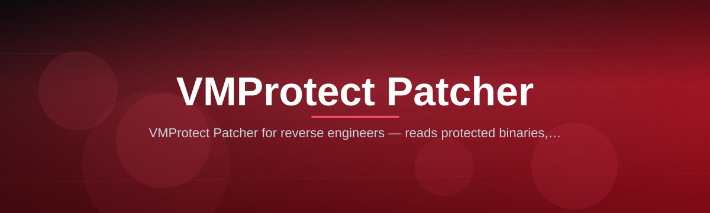

# VMProtect-Patcher-4773

*A local Windows utility for reverse engineers who need a repeatable way to work with VMProtect-protected binaries.*

## What this is

VMProtect-protected executables are deliberately hard to analyze — code virtualization and mutation obscure control flow, which slows down debugging, compatibility testing, and legacy software audits. Most teams end up scripting one-off solutions in a debugger every time a new sample shows up, which doesn't scale and doesn't leave a record of what was done.

VMProtect-Patcher-4773 is a standalone Windows application built specifically around that workflow. It loads a target binary, maps out its protection layers, and lets you apply, review, and export patches through a fixed set of repeatable steps instead of ad-hoc scripting. The name of this repository, the tool, and the interface all refer to the same single application — there is no separate SDK, plugin, or online service tied to it.

  

The button above opens the project landing page, where the current build is available to download.

## How this compares

| | VMProtect-Patcher-4773 | Manual debugger scripting | Generic unpacking tools | Online analysis services |
|---|---|---|---|---|
| Setup time | Minutes, single executable | Hours per script | Varies, often needs config | None, but upload required |
| VMProtect-specific handling | Built in | Depends on script author | Rarely tuned for VMProtect | Rarely tuned for VMProtect |
| Runs fully offline | Yes | Yes | Usually | No |
| Repeatable output/logs | Yes, exportable | Manual notes only | Sometimes | Depends on provider |
| Data leaves your machine | Never | Never | Never | Always |

## Who it is for

- **Reverse engineers** studying how a specific VMProtect build transforms code
- **Malware analysts** who need a consistent, offline first pass on protected samples
- **Software compatibility testers** checking how legacy VMProtect-protected tools behave on current Windows builds
- **Security researchers** documenting protection layers for reports or coursework
- **Students** learning how commercial code virtualization tools structure their output

## What you can do

- **Load a VMProtect-protected binary** directly from disk, no preprocessing required
- **Scan and list protection layers** the tool recognizes in the target file
- **Identify patch targets** within virtualized sections before touching anything
- **Apply patches** to a working copy, leaving the original file untouched
- **Compare original and modified sections** side by side before exporting
- **Export a detailed run log** describing every change made in a session
- **Batch process multiple files** using the same patch profile
- **Save and reuse patch profiles** across similar VMProtect builds

## Getting started

1. Open the landing page using the download button on this page.
2. Download the current build for Windows.
3. Run the executable — no installer or setup wizard is required.
4. Load your target file from the application's main window.
5. Review the detected protection layers before applying any changes.

## Requirements

- Windows 10 or Windows 11, 64-bit
- Standalone executable — no toolchain, SDK, or additional runtime install
- A few hundred MB of free disk space for working copies and logs
- Local administrator rights are not required for normal use

## How it works

1. The target binary is loaded and parsed without modifying the source file.
2. The tool scans for known VMProtect protection markers and layer boundaries.
3. Candidate patch targets are listed with their location and layer context.
4. Selected patches are applied to a working copy, never the original.
5. A run log and the modified copy are exported to a folder you choose.

## Keyboard shortcuts

| Shortcut | Action |
|---|---|
| `Ct